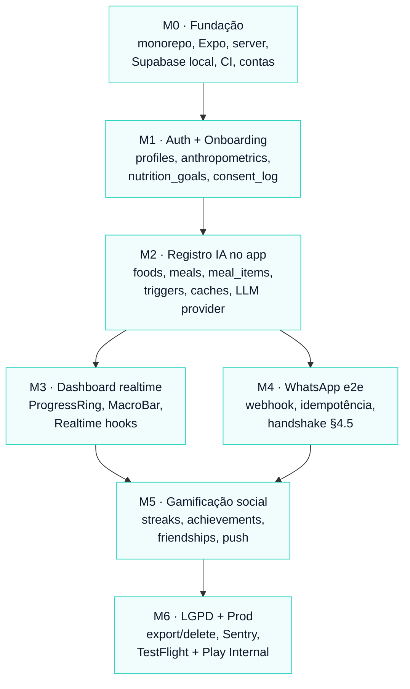

# Plano de Desenvolvimento — Fitbrother

## Contexto

Repo greenfield. Já existe: `CLAUDE.md`, `FEATURES.md`, `DESIGN_SYSTEM.md`, `tailwind.config.ts`, e 3 componentes base (`components/{Button,Card,Input}.tsx`) alinhados ao design system — `Input.EyeIcon` ainda é placeholder a substituir por `lucide-react-native`. Não existe `app/`, `package.json`, `supabase/`, `server/`, nem mocks de tela além de PNGs em `app_example/`.

Objetivo: entregar **todas** as features de `FEATURES.md §4–7` funcionando ponta a ponta. Sucesso = um usuário novo consegue: (1) completar onboarding, (2) registrar refeição por texto/áudio no app **e** via WhatsApp, (3) ver dashboard realtime, (4) ganhar streak e conquistas, (5) competir com amigos no ranking semanal, (6) exportar/deletar conta (LGPD).

Decisões já fixadas:
- **Monorepo** com `npm workspaces` (`apps/mobile`, `apps/server`, `packages/shared`, `supabase/`).
- **LLM:** Gemini 1.5 Flash default, atrás de interface `LLMProvider` plugável (`LLM_PROVIDER` env troca para OpenAI).
- **Contas externas:** nenhuma criada — M0 inclui walkthrough.
- **Ritmo:** solo full-time, ~1 semana por milestone.
- **Formato:** M0→M6 incremental, cada um com critério de "feito".

---

## Shape do plano



M3 e M4 são independentes depois de M2 (dashboard vs WhatsApp). Tudo o resto é linear.

---

## Riscos e premissas

- **Aprovação WhatsApp/Meta** leva 1–5 dias úteis. Inicia em **M0** mesmo sem usar até M4; o test number da Meta serve para dev.
- **Gemini function calling** ≠ OpenAI tool calls em shape de schema — a camada `LLMProvider` normaliza para o schema canônico de `FEATURES §4.2`.
- **Expo Go não basta** (push, gravação opus, signed audio upload). Dev build EAS desde M2.
- **Server precisa URL pública** para webhook Meta (M4). Plano assume Fly.io (alternativas: Render, Railway).
- TACO pt-BR (~600 alimentos UNICAMP) basta para `foods` no MVP; USDA fica para v2.
- `expo-av` no MVP; migrar para `expo-audio` quando upgrade de SDK.

---

## Layout final do monorepo

```
fitbrother/
├── package.json                # workspaces: apps/*, packages/*
├── .env.example                # vars consolidadas mobile + server
├── tsconfig.base.json
├── .github/workflows/ci.yml
├── apps/
│   ├── mobile/                 # Expo Router
│   │   ├── app/                # rotas (auth, onboarding, tabs, settings)
│   │   ├── components/         # Button, Card, Input (movidos) + domain/
│   │   ├── lib/                # supabase, colors, motion, hooks
│   │   ├── tailwind.config.ts  # movido do root
│   │   └── package.json
│   └── server/                 # Fastify + pg-boss workers
│       ├── src/{routes,services,workers,lib}/
│       └── package.json
├── packages/
│   ├── shared/                 # zod schemas, LLMProvider, prompt-version
│   └── db-types/               # tipos gerados por supabase gen types
└── supabase/
    ├── config.toml
    ├── migrations/             # 0001_*.sql ... 00NN_*.sql
    └── seed/                   # foods (TACO), achievements
```

`CLAUDE.md`, `FEATURES.md`, `DESIGN_SYSTEM.md` permanecem no root.

---

## M0 — Fundação e provisionamento (semana 1)

**Meta:** repo executável; Expo abrindo home com Plus Jakarta carregada; backend `/health` OK; Supabase local subindo; CI verde; contas externas criadas e `.env` preenchido.

### Walkthrough de contas (ordem importa)

1. **Supabase** — org gratuita; projetos `fitbrother-dev` e `fitbrother-staging` (prod só no M6). Salvar `SUPABASE_URL`, `SUPABASE_ANON_KEY`, `SUPABASE_SERVICE_ROLE_KEY` no 1Password. CLI já vem como `devDependency` do monorepo (`npm install` na raiz).
2. **Google Cloud / Gemini** — projeto GCP → habilitar "Generative Language API" → API key restrita a essa API. `GEMINI_API_KEY`.
3. **OpenAI** — billing com **hard cap USD 20/mês**, `OPENAI_API_KEY` (escopo Whisper).
4. **Meta for Developers** — Business Manager → app *Business* → adicionar produto WhatsApp → usar test number gratuito. Salvar `WHATSAPP_APP_SECRET` (app), `WHATSAPP_VERIFY_TOKEN` (string sua), `WHATSAPP_PHONE_NUMBER_ID`, `WHATSAPP_ACCESS_TOKEN`. **Submissão para revisão** (1–5 dias) — não bloqueia M0–M3.
5. **Expo / EAS** — `npx eas-cli@latest login` → `eas init` em `apps/mobile`. `EAS_PROJECT_ID`.
6. **Sentry** — 2 projetos: `fitbrother-mobile` (React Native) e `fitbrother-server` (Node). `SENTRY_DSN_MOBILE`, `SENTRY_DSN_SERVER`.
7. **Cloudflare Tunnel** (dev): `cloudflared tunnel login` — para expor webhook local no M4.

### Tasks de código

- `package.json` raiz com `workspaces: ["apps/*", "packages/*"]` e scripts `dev:mobile`, `dev:server`, `db:start`, `db:reset`, `db:types`, `typecheck`, `lint`.
- `apps/mobile`: `npx create-expo-app . -t blank-typescript`. Deps: `nativewind@^4`, `tailwindcss@^3`, `expo-font`, `@expo-google-fonts/plus-jakarta-sans`, `lucide-react-native`, `react-native-svg`, `react-native-reanimated`, `@gorhom/bottom-sheet`, `expo-haptics`, `@tanstack/react-query`, `zustand`, `@supabase/supabase-js`, `expo-router`, `expo-secure-store`.
- Mover `tailwind.config.ts` raiz → `apps/mobile/tailwind.config.ts`; ajustar `content` para `./app/**/*`, `./components/**/*`.
- Mover `components/{Button,Card,Input}.tsx` → `apps/mobile/components/`. Trocar `EyeIcon` por `<Eye />`/`<EyeOff />` de `lucide-react-native` em `Input.tsx` (linhas 23–39, 100–103).
- `apps/mobile/app/_layout.tsx` carrega fontes via `useFonts`; `SplashScreen.preventAutoHideAsync()` até pronto.
- `apps/mobile/lib/colors.ts` (espelho JS dos tokens Tailwind para SVG/Reanimated), `lib/motion.ts`, `lib/supabase.ts` (client + helpers), `lib/storage.ts` (audio uploads).
- `apps/server`: Fastify + TypeScript + `pino` + `envalid`; rota `GET /health`. Estrutura `src/{routes,services,workers,lib}/`. `tsx watch src/server.ts`.
- `packages/shared`: `zod` schemas (`MealExtractionSchema`, `OnboardingPayloadSchema`), `lib/prompt-version.ts` exporta `LLM_PROMPT_VERSION = "v1"`.
- `supabase init`; primeira migration `0000_init.sql` vazia. `supabase start` (Docker).
- `.env.example` consolidado conforme `FEATURES §7.5` + `EAS_PROJECT_ID`.
- Sentry SDK no mobile (`@sentry/react-native`) e server (`@sentry/node`), DSNs opcionais (no-op se ausentes).
- Husky + lint-staged: ESLint + Prettier + typecheck pre-commit.
- GitHub Actions (`.github/workflows/ci.yml`): typecheck + lint + `supabase db push --dry-run`.

**Feito quando:** `npm run dev:mobile` abre Expo na home com fonte correta; `npm run dev:server` responde `GET /health → 200`; `supabase start` sobe Postgres local; CI verde no primeiro push.

---

## M1 — Auth, onboarding e identidade (semana 2)

**Meta:** novo usuário se cadastra (email+senha), completa os 8 steps de `FEATURES §4.1`, banco fica com `profiles`, `anthropometrics`, `nutrition_goals`, `subscriptions`, `consent_log` populados e protegidos por RLS.

### Migrations (ordem fixa)

- `0001_extensions.sql` — `pgcrypto`, `pg_trgm`, `unaccent`.
- `0002_enums.sql` — todos enums de `FEATURES §3.3` (`activity_level`, `goal`, `meal_type`, `meal_source`, `unit`, `notification_kind`, `wa_direction`, `wa_kind`, `food_source`, `friendship_status`, `consent_scope`, `subscription_plan`, `subscription_status`, `sex`).
- `0003_profiles.sql` — schema completo + trigger `set_updated_at` + RLS `owner_all`.
- `0004_anthropometrics.sql` — append-only + trigger `BEFORE INSERT` calcula `bmr_kcal` (Mifflin-St Jeor) e `tdee_kcal` snapshot do `activity_level` (`sedentary=1.2, light=1.375, moderate=1.55, active=1.725, very_active=1.9`).
- `0005_nutrition_goals.sql` — UNIQUE parcial `WHERE effective_to IS NULL`.
- `0006_subscriptions.sql` — placeholder com default `plan=free, status=active`.
- `0007_consent_log.sql`.
- RLS `owner_all` em todas.

### Backend

- `POST /onboarding/complete` (auth required) — valida payload zod, em transação: insere `profiles`, `anthropometrics`, `nutrition_goals` inicial, `subscriptions`, 3 rows em `consent_log`. Meta inicial: `kcal = TDEE × {lose: 0.8, maintain: 1.0, gain: 1.1, recomp: 0.95}`; `protein_g = peso × {2.0 lose/recomp, 1.6 maintain/gain}`; `fat_g = kcal × 0.25 / 9`; `carbs_g = (kcal − 4·protein − 9·fat) / 4`.
- `GET /me` — profile + meta vigente + último anthropometric.
- Middleware Supabase Auth via JWT no header.

### Mobile

- `app/(auth)/welcome.tsx` — referenciar mocks em `app_example/Welcome Screen*.png`.
- `app/(auth)/sign-in.tsx`, `app/(auth)/sign-up.tsx` — Supabase Auth email+senha. Google/Apple **fora do MVP**.
- `app/(onboarding)/index.tsx` … `step-8.tsx` — 8 telas com Progress Bar (`DESIGN_SYSTEM §11.6`) + Onboarding Nav Buttons (§11.4).
- Wheel picker para peso/altura/idade (`react-native-wheel-pick`).
- Timezone via `Intl.DateTimeFormat().resolvedOptions().timeZone` com override.
- Estado entre steps via Zustand (`useOnboardingStore`) — descarta após `POST /onboarding/complete`.
- Tela de termos: 3 checkboxes (`terms`, `privacy`, `ai_processing`) — todos obrigatórios; `policy_version` fixo `"v1.0"`.

**Feito quando:** conta nova → sign-up → completa 8 steps → cai na `(tabs)/index` (placeholder); banco tem 1 row em `profiles`, 1 em `anthropometrics` com BMR/TDEE corretos, 1 em `nutrition_goals` com `effective_to IS NULL`, 3 em `consent_log`, 1 em `subscriptions`; SELECT em `profiles` de A com JWT de B retorna vazio.

---

## M2 — Catálogo `foods` + registro IA no app (semana 3)

**Meta:** usuário registra refeição por texto ou áudio **dentro do app** e ela aparece na lista da home com macros corretos. Pipeline `FEATURES §4.2` end-to-end **sem** WhatsApp.

### Migrations

> Numeração ajustada: M1 ocupou até `0009_anthropometrics_allow_delete.sql`, então M2 começa em `0010`.

- `0010_foods.sql` + índice GIN `name_normalized gin_trgm_ops`.
- `0011_meals.sql` (com `deleted_at`, `review_required`, `total_*` mantidos por trigger — **não** GENERATED, `id uuid PK sem default` pra optimistic UI), índice `(user_id, consumed_at DESC) WHERE deleted_at IS NULL`.
- `0012_meal_items.sql` (ON DELETE CASCADE de `meals` + soft delete próprio em sincronia com parent).
- `0013_meal_triggers.sql` — **STATEMENT-level** trigger em `meal_items` (transition tables) recalcula `meals.total_*` e enfileira recompute de `daily_summaries`. `AFTER UPDATE OF deleted_at ON meals` e `AFTER UPDATE OF review_required ON meals` também disparam recompute.
- `0014_daily_summaries.sql` + função `fitbrother_recompute_daily_summary(p_user_id uuid, p_day date)` que **respeita boundary `day_start_hour`**, pega `pg_advisory_xact_lock` (race-safe) e seta `goal_hit` segundo regra fixa.
- `0015_ai_usage.sql` + função `fitbrother_assert_ai_cap(user, kind)` lança `AI_QUOTA_EXCEEDED`.
- `0016_transcriptions.sql` (`audio_hash` PK).
- `0017_ai_extractions.sql` (`input_hash` PK) + tabela `ai_extraction_hits` separada pra analytics per-user.
- `0018_create_meal_with_items.sql` — RPC atômico (espelhando `complete_onboarding` do M1).
- **Storage bucket `meal-audios`** privado, RLS `auth.uid()::text = (storage.foldername(name))[1]`.
- **Seed `foods`** — script `supabase/seed/foods-taco.ts` baixa CSV TACO/UNICAMP, normaliza (`lower(unaccent(name))`), insere ~600 rows `verified=true source='taco'`.

### Backend

- `packages/shared/llm/provider.ts`:
  ```ts
  export interface LLMProvider {
    extractMeal(input: { text: string; locale: string }): Promise<MealExtraction>;
  }
  ```
- `packages/shared/llm/gemini.ts` — `@google/generative-ai`, function calling com schema canônico (`FEATURES §4.2`).
- `packages/shared/llm/openai.ts` — alternativa via tool calls. Seleção por `LLM_PROVIDER` env (`gemini` default).
- `apps/server/src/services/transcription.ts` — SHA-256 do áudio → lookup `transcriptions` → miss → Whisper (`whisper-1`) → cache.
- `apps/server/src/services/extraction.ts` — `input_hash = sha256(text + LLM_PROMPT_VERSION + locale)` → lookup `ai_extractions` → miss → `LLMProvider.extractMeal` → cache + mede tokens.
- `apps/server/src/services/foods.ts` — para cada item, query `SELECT id, kcal_per_100g, ... FROM foods WHERE name_normalized % $1 AND verified=true ORDER BY similarity DESC LIMIT 1`; se match ≥ 0.6, **sobrescreve macros** pelo catálogo (ajustado para `quantity*unit`).
- `apps/server/src/services/ai-usage.ts` — `assertWithinCap(user_id, day, kind)`; `recordUsage(kind, units, cost_cents)`. `day` calculado pelo boundary.
- `apps/server/src/services/meals.ts` — `createMealFromExtraction(...)` em transação: INSERT `meals`, INSERT `meal_items[]`, UPDATE `ai_usage`. Trigger faz o resto.
- Storage: bucket `meal-audios` privado; RLS `auth.uid() = (storage.foldername(name))[1]`; path `{user_id}/{meal_id}.opus`; signed upload URL via service role.
- **Rotas:**
  - `POST /meals/text` `{ text, consumed_at? }`
  - `POST /meals/audio` (multipart, ≤25MB / ≤10min) — upload → transcribe → extract → create
  - `GET /meals?day=YYYY-MM-DD`
  - `PATCH /meals/:id` (editar items)
  - `POST /meals/:id/confirm` (sai de `review_required`)
  - `DELETE /meals/:id` (soft)
  - `GET /me/daily-summary?day=...`

### Mobile — capture-first (composer persistente)

> Decisão de UX (mai/2026): em vez de FAB + Bottom Sheet, o app adota composer fixo no rodapé (estilo iMessage/WhatsApp) e remove a tab bar. Friends/Profile viram ícones no header superior. Pattern apropriado pra app onde toda visita tem a mesma intenção (registrar refeição).

- `app/index.tsx` — Home com HomeHeader (saudação + ícones Users/User), lista de Meal Cards, EmptyMealsState, MealComposer fixo no rodapé.
- `app/friends.tsx`, `app/profile.tsx` — push do header (placeholders pra M5/M6).
- `app/meal/[id].tsx` — detalhe + edição inline (M3 expande com rings).
- **MealComposer** (`components/domain/MealComposer.tsx`): state machine `idle | typing | recording | processing`. TextInput multiline + mic à direita. Mic vira ➤ quando há texto. Tap mic = recording in-place (input vira waveform + timer + cancel/stop). Long-press mic = hold-to-record. Long-press input = "Adicionar manualmente".
- **AudioRecorder** com `expo-av` (opus 24kbps + metering) — haptics: `Heavy` start, `Success` stop, `Warning` cancel, `Medium` processing, `Success` saved.
- **MealCard** (`components/domain/MealCard.tsx`): §12.3 do DESIGN_SYSTEM, amber border + chip "Revisar" quando `review_required=true`. Swipe-left revela delete.
- **MealSkeleton** durante processamento (2-8s).
- **Optimistic UI** com `client_meal_id` gerado no cliente — server usa como `meals.id`, Realtime de-dup automático.
- **ErrorBanner** sticky abaixo do header pra `AI_QUOTA_EXCEEDED` — desabilita mic, mantém input pra cache hits, CTA full-screen manual.
- React Query para `GET /meals?day=...`; `useMealsRealtime` invalida em UPDATE/INSERT em `meals`.

### Tech debt carregado de M1

- **SecureStore > 2048 bytes** (warning na boot do app, vira erro em SDKs futuros): a sessão Supabase (access + refresh token serializados num único valor) ultrapassa o limite do `expo-secure-store` no iOS. Trocar o storage adapter em `apps/mobile/lib/supabase.ts` por: (a) split em 2 keys (`sb-access` / `sb-refresh`), ou (b) `AsyncStorage` + criptografia em camada acima. Card no Trello (Backlog).

**Feito quando:** "Comi 2 ovos e café" no app → 5–8s depois Meal Card visível com ~140 kcal, ~12g P; segundo registro idêntico não chama Gemini/Whisper (log mostra cache hit); `AI_CAP_LLM_TOKENS=10` → segunda tentativa retorna `AI_QUOTA_EXCEEDED`; `daily_summaries` atualiza após INSERT em `meal_items`; `confidence < 0.6` → `review_required=true` e Meal Card mostra borda warning + chip Confirmar.

**Status M2.3 (texto, sem áudio):** ✅ implementado em 2026-05-23 via branch `m2-3-mobile-capture-first`. Composer + Home + Detalhe com optimistic UI; áudio segue em M2.4 (mic já aparece no composer com handler stub).

**Status M2.4 (áudio):** ✅ implementado em 2026-05-24 via branch `m2-4-audio-capture`. Hold-to-record WhatsApp-style com waveform animado, upload direto pro Storage, Whisper-1 com cache SHA-256, extração reaproveita Gemini (agora normalizando pra PT-BR canonical). MealCard atualizado pra listar itens em linhas. Pull-to-refresh + skeleton em linhas como polimento. PR #5 + #6 merged.

---

## M3 — Dashboard realtime, edição, histórico (semana 4)

**Meta:** home final renderizando Progress Ring hero + 3 rings de macro, atualizando em tempo real, com edição inline e histórico navegável.

### Backend

- View `vw_today_summary(user_id)` retorna linha de `daily_summaries` para o `day` atual calculado por boundary.
- Função `fitbrother_today(user_id)` retorna `date` atual respeitando `timezone + day_start_hour`.
- Habilitar Realtime no Supabase em `daily_summaries` e `meals`.

### Mobile

- `components/domain/ProgressRing.tsx` — SVG circular, animação Reanimated com `Motion.duration.slow` decelerate. Props conforme `DESIGN_SYSTEM §12.1`.
- `components/domain/MacroBar.tsx` (§12.2).
- `components/domain/MealCard.tsx` (§12.3) — estados `review_required`, fonte WA.
- `app/(tabs)/index.tsx` finalizada — header (saudação + StreakCounter placeholder), Progress Ring hero 160 (calorias), 3 rings 80 (P/C/G), lista Meal Cards, Empty State (§12.10).
- `app/meal/[id].tsx` — detalhe + edição de items; botão Confirmar; Skeleton (§12.11) no loading.
- `app/history/index.tsx` — agrupada por dia, infinite scroll por semana via `daily_summaries`.
- Hooks: `useDailySummaryRealtime(user_id)` assina `realtime:public:daily_summaries:user_id=eq.<id>` e invalida React Query. `useMealsRealtime(user_id, day)` análogo.
- (Sem tab bar — Friends/Profile via ícones no HomeHeader já implementados em M2.4. M3 só polirá o header com StreakCounter.)

**Feito quando:** dia com 3 refeições renderiza com macros e rings corretos; deletar meal → ring atualiza em <1s sem refresh manual; 2 dispositivos do mesmo user logados refletem em <2s; edição de `quantity` recalcula totais.

---

## M4 — WhatsApp end-to-end (PAUSADO — Meta business verification recusada em 2026-05-22)

> **Status:** Pausado. Meta recusou a business verification em mai/2026. Sequência ajustada: M0 → M1 → M2 → M3 → **M5 → M6** → M4 (quando Meta destravar). Test number da Meta continua funcionando pra dev sem verification.

**Meta:** áudio/texto no WhatsApp aparece no app em <8s; idempotência funciona; cota respeitada; verificação de telefone via handshake.

### Pipeline canônico (ordem obrigatória — `FEATURES §6`)

```
Meta WA ──► POST /webhooks/whatsapp
              │ 1. valida HMAC x-hub-signature-256
              │ 2. INSERT wa_messages (provider_message_id UNIQUE)
              │    └─ conflito → 200 OK, return
              │ 3. responde 200 imediato; enfileira pg-boss job
              ▼
         wa-processor worker
              │ 4. match profiles.phone_e164
              │    └─ sem match → reply onboarding deep link, return
              │ 5. ai_usage.assertWithinCap → excedido → reply "limite", return
              │ 6. áudio? Media URL + bearer → SHA-256 → transcriptions cache
              │ 7. comando (/hoje, /meta, /streak)? canned reply, return
              │ 8. extraction (ai_extractions cache, prompt_version)
              │ 9. foods fuzzy match (≥0.6 → sobrescreve macros)
              │ 10. tx: INSERT meals + meal_items + UPDATE ai_usage
              │ 11. wa-client.sendText (janela aberta — inbound recém-chegou)
              │ 12. UPDATE wa_messages.processed_at = now()
              ▼
   Trigger meal_items ──► daily_summaries ──► Realtime ──► app
```

Falha após passo 8 → `processed_at IS NULL` → cron retry; caches em 6 e 8 evitam pagar IA duas vezes.

### Migrations

- `0016_wa_conversations.sql`.
- `0017_wa_messages.sql` com `provider_message_id UNIQUE` + trigger `AFTER INSERT WHERE direction='in'` que atualiza `profiles.wa_window_expires_at = now() + interval '24 hours'` e (se primeira inbound) `phone_verified_at = now()`.
- Índice `wa_messages (user_id, processed_at) WHERE processed_at IS NULL` (fila de retry).

### Backend

- `apps/server/src/routes/webhooks/whatsapp.ts`:
  - GET: valida `hub.verify_token`.
  - POST: valida HMAC com `WHATSAPP_APP_SECRET` (timing-safe); responde 200 em <20s; enfileira `pg-boss` job `wa-process`.
- `apps/server/src/workers/wa-processor.ts` — segue ordem do diagrama acima.
- `apps/server/src/services/wa-client.ts` — `sendText(to, body)`, `sendInteractive(to, action)`. Lança `WaWindowClosed` se `wa_window_expires_at <= now()`. **Nunca** envia template pago.
- Cron 5min: reprocessa `wa_messages WHERE processed_at IS NULL AND created_at > now() - 24h`.

### Verificação de telefone (handshake — `FEATURES §4.5`)

- `app/(onboarding)/connect-whatsapp.tsx` — deep link `wa.me/<bot_phone>?text=Vamos%20começar` + QR (`react-native-qrcode-svg`).
- App polla `GET /me` até `phone_verified_at IS NOT NULL` (ou Realtime em `profiles`).
- Bot responde com mensagem de boas-vindas após primeira inbound.
- Skippable; pode ser concluído depois em Perfil.

### Operação

- Cloudflare Tunnel local: `cloudflared tunnel run` → URL pública estável apontada no Meta Developer Console.
- Deploy server staging em Fly.io: `fly launch` + `fly secrets set ...`. URL pública estável serve para Meta apontar.
- Test number Meta cobre validação enquanto app review está pendente.

**Feito quando:** áudio "almocei 200g de arroz e frango" no WhatsApp → 5–8s depois Meal Card no app; reenviar mesma `provider_message_id` não duplica meal; `/hoje` retorna macros do dia; `AI_CAP=0` → bot responde "limite atingido" e não cria meal; handshake → `phone_verified_at` setado + welcome chega.

---

## M5 — Gamificação social (semana 6)

**Meta:** streak diário funciona, conquistas desbloqueiam, amigos competem no ranking semanal, push notifications chegam.

### Migrations

- `0018_streaks.sql` (PK `user_id`).
- `0019_achievements.sql` + seed 10 conquistas: streak 3/7/14/30, primeiro registro, 50 refeições totais, 7 dias com `goal_hit` numa semana, primeiro amigo, primeira refeição via WhatsApp, primeira semana completa.
- `0020_user_achievements.sql` (PK composta).
- `0021_friendships.sql` + view `friends_summaries_view` (UNION dos dois lados quando `status='accepted'`; expõe **apenas** `day, goal_hit, meals_count` — nunca macros).
- `0022_push_tokens.sql`.
- `0023_notifications.sql`.

### Backend

- Cron horário `streak-tick` (pg-boss): para usuários cujo `EXTRACT(HOUR FROM now() AT TIME ZONE timezone)::int = day_start_hour`, lê `daily_summaries` do dia anterior; se `goal_hit=true`, incrementa `streaks.current_streak` e atualiza `longest_streak`; senão reseta para 0.
- Trigger `AFTER UPDATE` em `daily_summaries` → enfileira `evaluate-achievements`.
- Worker `evaluate-achievements` lê `achievements.criteria_json` (DSL: `{"type":"streak","value":N}`, `{"type":"meals_total","value":N}`, `{"type":"weekly_hits","value":N}`); avalia; INSERT em `user_achievements` se cruzar limiar; enfileira `dispatch-notification`.
- `services/notifications.ts → dispatch(user_id, notif)`:
  - sempre tenta push (Expo Push API) se houver `push_tokens` ativos;
  - se `wa_window_expires_at > now()` também envia WA;
  - grava 1 row em `notifications` por canal tentado.
- Cron 21h (boundary do usuário) — `streak-alert`: usuários com `last_hit_day = ontem` e nenhum meal hoje recebem aviso.
- Cron 19h — `goal-reminder`: kcal < 70% da meta e janela WA aberta → reminder.
- **Rotas:** `POST /push-tokens`, `POST /friends/request`, `POST /friends/:id/accept`, `POST /friends/:id/decline`, `GET /friends`, `GET /leaderboard/weekly` (agrega últimas 7 noites em `friends_summaries_view`), `GET /achievements`, `GET /me/achievements`.

### Mobile

- Pedido de permissão de notificação ao fim do onboarding (`expo-notifications`); token → `POST /push-tokens`.
- `components/domain/StreakCounter.tsx` (§12.4) — pulse infinito ativo; grayscale em risco; respeitar `useReducedMotion()`.
- `app/(tabs)/friends.tsx` — busca por phone (gate em `phone_verified_at`), pedidos pendentes, lista de amigos, leaderboard semanal (`LeaderboardRow` §12.13).
- Toast hero (§12.12 `variant=info` custom) quando recebe push `kind=achievement`.
- StreakCounter no header da Home (substitui placeholder M3).

**Feito quando:** 3 dias `goal_hit=true` consecutivos → `streaks.current_streak = 3`; adicionar amigo por phone funciona; ranking semanal mostra ambos; push de risco às 21h do dia nutricional (simulável); conquista "Primeiro Streak" mostra toast + push; `friends_summaries_view` **não** expõe macros (validar via SQL com JWT de amigo).

---

## M6 — LGPD, observabilidade, produção (semana 7+)

**Meta:** app pronto para usuários reais — exportar/deletar dados, custos sob controle, alertas configurados, builds em TestFlight + Play Internal.

### Migrations

- Tabela auxiliar `metrics_daily(day, metric, value)` para histórico de custo/sucesso.

### Backend

- **LGPD:**
  - `GET /account/export` → ZIP com JSON de `profiles, anthropometrics, nutrition_goals, meals, meal_items, consent_log, notifications, user_achievements` + `wa_messages` com `payload` redacted.
  - `DELETE /account` → marca `auth.users.deleted_at` + soft delete em cascata.
  - Cron diário `purge-accounts`: hard delete de usuários com `deleted_at < now() - 30 days`.
  - `POST /account/consent` `{ scope, granted: boolean }` → atualiza `consent_log.revoked_at`.
- Cron diário `purge-audios`: deleta áudios de `meal-audios` cujo `meals.created_at < now() - 30 days`.
- **Sentry:** contexto `user_id`, breadcrumbs do pipeline §6 com `request_id`.
- **Logs pino** estruturados com `user_id`, `wa_message_id`, `meal_id`, `request_id` em cada etapa.
- **Métricas** (cron diário em `metrics_daily`): taxa de sucesso de extração (`confidence >= 0.6`), p50/p95 latência por etapa, custo agregado por modelo.
- **Alerta** `wa_messages WHERE processed_at IS NULL AND created_at < now() - 5min` → Sentry capture + webhook Discord/Slack.

### Mobile

- `app/(tabs)/profile.tsx` — settings: exportar dados, deletar conta, gerenciar consentimento granular, alterar timezone, alterar `day_start_hour`.
- Tela "Sobre" com versão (`Constants.expoConfig.version`) + links Termos/Privacidade.

### Ops

- Provisionar Supabase **prod** (rodar TODAS migrations + seed `foods`).
- Deploy server prod (Fly.io) com autoscale básico + health check.
- EAS Build + Submit: TestFlight (iOS) e Play Console Internal Testing (Android).
- Submissão final WhatsApp Business à Meta (display name + ícone + business verification).
- Política de Privacidade + Termos publicados em URL fixa, versionados (`policy_version`).
- PITR backup Supabase (plano Pro — avaliar custo).
- **Runbook** (`docs/runbook.md`): webhook preso, cota Gemini/OpenAI estourada globalmente, Sentry alertando pipeline, RLS bug, recuperação de áudio deletado.

**Feito quando:** usuário exporta JSON do próprio dado; deleta conta; após 30d simulado, hard delete via cron; build TestFlight + Play Internal instalado; smoke test e2e funciona; Sentry recebe erros com `user_id`; custo diário visível em `metrics_daily`; runbook commitado.

---

## Verificação end-to-end (após M6)

Cenário: **Maria** (nova) e **João** (existente), amigos.

1. Maria instala build TestFlight → sign-up email → completa onboarding 8 steps → conecta WhatsApp via handshake.
2. Maria envia áudio "café com pão e mamão" no WhatsApp → 5–8s depois Meal Card visível no app via Realtime.
3. Maria registra mais 2 refeições no app via texto, atinge meta → `daily_summaries.goal_hit=true`.
4. Cron horário no `day_start_hour` da Maria incrementa `streaks.current_streak = 1`.
5. João adiciona Maria por phone; aceite; leaderboard semanal mostra ambos.
6. Conquista "Primeiro Registro" desbloqueia para Maria; toast + push.
7. Aos 21h boundary, Maria sem refeição hoje → push de alerta.
8. Maria pede `GET /account/export` no Settings → recebe ZIP.
9. Maria deleta conta → some das views; D+30, hard delete via cron.

---

## Arquivos críticos por milestone (atalho)

- **M0:** `package.json` (root), `apps/mobile/{package.json, tailwind.config.ts, app/_layout.tsx, lib/colors.ts, lib/supabase.ts}`, `apps/server/src/server.ts`, `supabase/config.toml`, `.env.example`, `.github/workflows/ci.yml`.
- **M1:** `supabase/migrations/0001..0007*.sql`, `apps/server/src/routes/{onboarding,me}.ts`, `apps/mobile/app/(auth)/*`, `apps/mobile/app/(onboarding)/*`.
- **M2:** `supabase/migrations/0008..0015*.sql`, `supabase/seed/foods-taco.ts`, `packages/shared/llm/{provider,gemini,openai}.ts`, `apps/server/src/services/{transcription,extraction,foods,ai-usage,meals}.ts`, `apps/server/src/routes/meals.ts`, `apps/mobile/components/domain/MealCard.tsx`, `apps/mobile/app/(tabs)/index.tsx`.
- **M3:** `apps/mobile/components/domain/{ProgressRing,MacroBar}.tsx`, `apps/mobile/lib/hooks/{useDailySummaryRealtime,useMealsRealtime}.ts`, `apps/mobile/app/meal/[id].tsx`, `apps/mobile/app/history/index.tsx`.
- **M4:** `supabase/migrations/0016..0017*.sql`, `apps/server/src/routes/webhooks/whatsapp.ts`, `apps/server/src/workers/wa-processor.ts`, `apps/server/src/services/wa-client.ts`, `apps/mobile/app/(onboarding)/connect-whatsapp.tsx`.
- **M5:** `supabase/migrations/0018..0023*.sql`, `apps/server/src/workers/{streak-tick,evaluate-achievements,streak-alert,goal-reminder}.ts`, `apps/server/src/services/notifications.ts`, `apps/server/src/routes/{friends,push-tokens,achievements,leaderboard}.ts`, `apps/mobile/components/domain/{StreakCounter,LeaderboardRow}.tsx`, `apps/mobile/app/(tabs)/friends.tsx`.
- **M6:** `apps/server/src/routes/account.ts`, `apps/server/src/workers/{purge-accounts,purge-audios,metrics-daily}.ts`, `apps/mobile/app/(tabs)/profile.tsx`, `docs/runbook.md`.

---

## Reuso explícito

- Componentes `Button`, `Card`, `Input` já existentes em `components/` (movidos para `apps/mobile/components/` no M0) — não reimplementar.
- Tokens de cor/tipo/espaço de `tailwind.config.ts` — referência única, sem duplicar HEX em código (`lib/colors.ts` espelha para SVG/Reanimated).
- Schemas `zod` em `packages/shared/` consumidos por mobile e server — uma definição só.
- `LLMProvider` interface única — trocar provider sem mexer no resto.

---

## Decisões em aberto (sinalize se quiser mudar)

1. **Host do server:** Fly.io vs Render vs Railway. Plano assume Fly.io.
2. **OAuth sign-in** (Google/Apple): fora do MVP. Mover para M6 se sobrar tempo.
3. **Audio recorder UX:** tap-to-toggle no MVP; hold-to-record após UX test.
4. **Submissão Meta WABA** acontece em paralelo com M0–M3 (revisão = 1–5 dias); test number cobre dev até lá.
