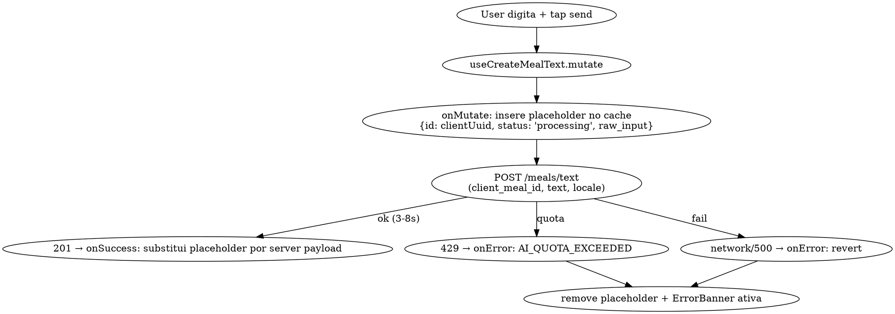
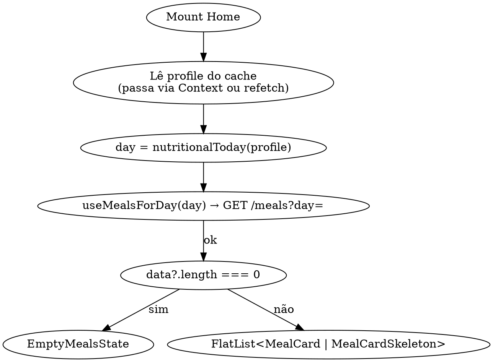

# M2.3 — Mobile capture-first (texto) — Design

**Status:** Draft → aguardando review.
**Data:** 2026-05-22.
**Milestone:** M2.3 do `docs/PLAN.md`.
**Escopo:** somente entrada por **texto**. Áudio fica para M2.4 (UI já preparada para receber).

---

## 1. Objetivo

Entregar o "feito quando" do M2 do `docs/PLAN.md:214`, restrito a texto: usuário logado e onboarded chega na Home, digita uma refeição em linguagem natural, vê um placeholder enquanto a IA processa, e em 3–8 s aparece o Meal Card real com macros calculados pelo backend `POST /meals/text` (já implementado). Inclui tela de detalhe básica (confirmar/deletar) e placeholders para Friends/Profile.

Não cobre rings, edição inline, realtime, áudio nem entrada manual — todos têm milestone próprio.

---

## 2. Estado atual do código

**Backend (pronto):** `apps/server/src/routes/meals.ts` tem `POST /meals/text`, `GET /meals?day=`, `GET /meals/:id`, `PATCH`, `POST /meals/:id/confirm`, `DELETE /meals/:id`, `GET /me/daily-summary`. Cache de extração via `ai_extractions`, fuzzy match contra `foods`, RPC atômico `create_meal_with_items`. RLS owner-only em todas as tabelas.

**Mobile (gap a fechar):** só existe `(auth)`, `(onboarding)` e um `app/index.tsx` que age como roteador (signed_out → /(auth), missing profile → /(onboarding), present → placeholder). Não existe Home funcional, nenhum componente de domínio, nenhuma chamada para `/meals/*`. React Query 5 está instalado no `package.json` mas `QueryClientProvider` não está montado.

**Migrations relacionadas:** `0010_foods.sql`–`0020_foods_fuzzy_match.sql` já aplicadas.

---

## 3. Arquitetura

### 3.1 Roteamento (Expo Router)

```
app/
├─ _layout.tsx              # adiciona QueryClientProvider; já tem fonts + safe-area + gesture-handler
├─ index.tsx                # mantém-se como guard (auth/onboarding/app). Quando present → Redirect to "/(app)"
├─ (auth)/...               # inalterado
├─ (onboarding)/...         # inalterado
└─ (app)/
   ├─ _layout.tsx           # Stack autenticado; re-verifica auth e perfil
   ├─ index.tsx             # Home
   ├─ friends.tsx           # placeholder ("Em breve")
   ├─ profile.tsx           # placeholder ("Em breve")
   └─ meal/[id].tsx         # Detalhe básico
```

Por que `(app)` group: isola telas autenticadas em um Stack próprio. Divisão de responsabilidades:
- `app/index.tsx`: orchestrator entre os 3 grupos (já existe). Determina onde redirecionar baseado em auth + presença de profile.
- `(app)/_layout.tsx`: só configura o Stack do grupo e monta o **ProfileProvider** (Context com `me`). **Não duplica** a checagem de auth — confia que quem entrou aqui passou pelo orchestrator. Se a sessão expirar enquanto navega (401), o `authedFetch` chama `signOut()` → próxima renderização do orchestrator manda pra `/(auth)`.

### 3.2 Data layer

```
apps/mobile/lib/
├─ api/
│  └─ meals.ts              # createMealText, listMeals, getMeal, confirmMeal, deleteMeal
├─ hooks/
│  ├─ useAuthSession.ts     # (existente)
│  ├─ useMealsForDay.ts     # query
│  ├─ useCreateMealText.ts  # mutation com optimistic
│  ├─ useConfirmMeal.ts     # mutation com optimistic
│  └─ useDeleteMeal.ts      # mutation com optimistic
├─ time/
│  └─ nutritional-day.ts    # nutritionalToday(profile) → "YYYY-MM-DD"
└─ query-client.ts          # singleton; default staleTime 30s, retry 1 em queries
```

**`nutritionalToday(profile)`** replica a regra do banco no cliente:
```ts
function nutritionalToday(profile: { timezone: string; day_start_hour: number }): string {
  const now = new Date();
  const inTz = new Date(now.toLocaleString("en-US", { timeZone: profile.timezone }));
  inTz.setHours(inTz.getHours() - profile.day_start_hour);
  return inTz.toISOString().slice(0, 10);
}
```
Justificativa: o cliente precisa do "hoje" para a queryKey e o parâmetro da listagem. O servidor é a fonte de verdade — `GET /meals?day=` já chama `fitbrother_nutritional_day` internamente, então drift no cliente só afeta paginação local (não atribuição errada de meal).

### 3.3 Componentes (`apps/mobile/components/domain/`)

| Arquivo | Responsabilidade | Estados |
|---|---|---|
| `HomeHeader.tsx` | Saudação + ícones Users/User (lucide), 44×44 hit. | Saudação muda por horário (manhã/tarde/noite). |
| `MealComposer.tsx` | Footer fixo: TextInput multiline + botão mic (lucide `Mic`) + botão send (➤, lucide `Send`). | `idle`, `typing` (send habilita), `processing` (visual disabled durante mutation). |
| `MealCard.tsx` | §12.3. Variantes: normal, `review_required` (border amber + chip "Revisar"). Tap → push pra `/meal/[id]`. | — |
| `MealCardSwipeable.tsx` | Wrapper com `react-native-gesture-handler` Swipeable; left swipe revela ação Delete (danger-500). | — |
| `MealCardSkeleton.tsx` | §12.11. Renderizado enquanto status `processing` no cache. | — |
| `EmptyMealsState.tsx` | §12.10 adaptado: copy "Diga sua primeira refeição lá embaixo ↓". | — |
| `ErrorBanner.tsx` | Sticky abaixo do header. | `quota_exceeded`, `offline`, `server_error`, `network`. Dismissable. |

**Botão único à direita do TextInput (segue PLAN.md M2.3):**
- Input vazio → ícone `Mic` (lucide). Em M2.3, `onPress` stub: haptic `Light` + toast "Áudio chega no próximo update".
- Input com texto → ícone `Send` (➤). `onPress` dispara `useCreateMealText.mutate({ text })`.
- Estado `processing` (mutation pendente) → ícone `Loader2` rotacionando via Reanimated; botão desabilitado.

Em M2.4, o handler do Mic vira o AudioRecorder real (long-press/tap-toggle a definir lá). Markup do composer fica idêntico em M2.3 e M2.4 — só o handler do estado "input vazio" muda.

### 3.4 State & cache strategy

- **React Query 5** com `QueryClientProvider` montado em `app/_layout.tsx`, antes do `<Stack>` (precisa estar acima de qualquer screen que use hooks).
- **Sem Zustand novo** para este milestone. O cache do React Query carrega o estado de meals; AuthSession e Profile permanecem onde estão.
- **Query keys:** `["meals", day]` (lista), `["meal", id]` (detalhe).
- **staleTime:** 30 s. `refetchOnWindowFocus: true` (default no RN equivale a refetch on app foreground).
- **gcTime:** 5 min.
- **`mutationFn` retries:** 0 (POST de meal não deve repetir automaticamente — duplicação visível pro usuário). Queries: `retry: 1`.

---

## 4. Fluxos críticos

### 4.1 Criar refeição (texto)



**Geração de UUID:** `expo-crypto` (`randomUUID()`) — já é dep transitiva via `expo`; se não, adicionar como dep direta.

**`locale`** passado pro `POST /meals/text`: usar `expo-localization` (já no `package.json`) — `Localization.getLocales()[0].languageTag` (fallback `"pt-BR"`). O server hoje usa pra prompt do LLM, então o valor influencia cache key de extração — manter consistente.

### 4.2 Confirmar (sair de review_required)

`useConfirmMeal.mutate({ id })`:
1. `onMutate`: flipa `review_required=false` no item dentro de `["meals", day]` e em `["meal", id]`.
2. POST `/meals/:id/confirm`.
3. `onError`: reverte.

### 4.3 Deletar (swipe-left ou botão no detalhe)

`useDeleteMeal.mutate({ id })`:
1. `onMutate`: remove o item da lista `["meals", day]`. Para `["meal", id]`, marca `deleted_at` localmente (não navega — quem aciona é a Home).
2. DELETE `/meals/:id`.
3. `onError`: re-insere na posição original. Toast `error` "Não foi possível apagar".

### 4.4 Lista (Home)



Itens com `id` que começam com client uuid e status `processing` (presentes apenas no cache local) renderizam como Skeleton. Itens normais renderizam como MealCardSwipeable.

**Sobre profile no cache:** o `app/index.tsx` atual já busca `/me` antes de deixar entrar. Para M2.3 vamos guardar o profile via Context (`ProfileProvider` em `(app)/_layout.tsx`) — evita re-fetch desnecessário e dá acesso a `timezone`/`day_start_hour` em qualquer screen do `(app)`.

---

## 5. Estados de erro & casos de borda

| Cenário | Comportamento |
|---|---|
| 401 ao chamar `/meals/*` | `authedFetch` já chama `signOut()` em 401. O guard do `(app)/_layout` detecta `signed_out` e redireciona. |
| 429 `AI_QUOTA_EXCEEDED` | ErrorBanner `quota_exceeded` ativa, persiste até dismiss manual ou troca de dia. POSTs não bloqueados client-side — server rejeita; UX deixa claro que tentar de novo vai falhar (botão send fica desabilitado enquanto banner ativo). |
| Timeout (`API_TIMEOUT_MS`) | Já lança `request_timeout`. Mostra banner `network`. |
| 500 server | Banner `server_error` com retry manual. |
| Refeição sem itens reconhecidos (`confidence < 0.6`) | Server já marca `review_required=true`. UI: MealCard com variante warning + chip "Revisar". |
| Swipe-delete sem internet | Optimistic remove + retry; em falha, re-insere + toast. |
| Boundary do dia muda durante uso (passou da meia-noite) | Próximo render recalcula `day`. Meals antigos saem da lista por refetch. Sem timer de meia-noite no M2.3 — usuário precisa interagir; aceitável pra MVP. |
| Mic tap em M2.3 | Haptic Light + Toast info "Áudio chega no próximo update". Stub no handler. |

---

## 6. Acessibilidade & conformidade ao CLAUDE.md

Auditoria de "regras de ouro UI" do `CLAUDE.md`:

- ✅ Tipografia: usar `font-sans-*`, nunca `font-medium`/`semibold`/`bold`.
- ✅ Números (macros, kcal): `style={{ fontVariant: ["tabular-nums"] }}`.
- ✅ Cores via token Tailwind (`primary-400`, `warning-500`, `neutral-*`, `danger-500`). Ícones lucide via `lib/colors.ts`.
- ✅ Hit target 44×44 em todos Pressable (ícones do header, send, mic, swipe-action).
- ✅ `accessibilityLabel` em todos icon-only buttons; `accessibilityRole` em Pressable / Cards interativos.
- ✅ Sombras: helper `Card` existente já trata `Platform.select`.
- ✅ Sem `dark:` em código novo.
- ✅ Ícones só `lucide-react-native`.
- ✅ Sem tags HTML.

---

## 7. Testes & verificação

### 7.1 Testes manuais (golden path)

1. Login + onboarding → chega na Home → vê EmptyMealsState.
2. Digita "1 banana e 200g de frango grelhado" → tap send → MealCardSkeleton aparece em <300 ms.
3. 3–8 s depois: card real com ~280 kcal, ~50 g P (varia conforme catálogo TACO).
4. Tap no card → detalhe lista os items, mostra Confirmar (se review_required) e Delete.
5. Confirmar → volta pra Home, chip desaparece.
6. Swipe-left no card da Home → ação Delete → card some.
7. Segundo POST idêntico no mesmo dia: log do server mostra `cache_hit: true`. (Verificar via `npm run dev:server`.)
8. Header tap em Users → `/(app)/friends` placeholder; tap em User → `/(app)/profile` placeholder.
9. Tap no mic → toast "Áudio chega no próximo update".

### 7.2 Testes de cota

- Setar `AI_CAP_LLM_TOKENS=10` no `.env` do server.
- Após algumas requisições, próximo POST retorna 429.
- ErrorBanner `quota_exceeded` aparece; botão send fica disabled.
- Refresh do app → banner deve reaparecer (estado derivado da última resposta, **não** persiste cross-session — aceitável: cap reseta no dia seguinte).

### 7.3 Verificação manual antes de PR

Rodar em iOS simulator + Web (Expo Web):
```bash
cd apps/mobile && npm run dev
```
Confirmar: lint limpo (`npm run lint` se existir), typecheck (`npm run typecheck`).

---

## 8. Out of scope (recap)

- 🎙 Áudio (gravação, upload, `POST /meals/audio`, Whisper) — **M2.4**.
- ✍️ Entrada manual (long-press do composer, screen de items 1-a-1) — **M2.4/M3**.
- 🎯 ProgressRing hero + 3 macro rings — **M3**.
- ✏️ Edição inline de items no detalhe — **M3**.
- 🔴 Realtime (`realtime:public:meals`, `daily_summaries`) — **M3**.
- 🔐 SecureStore split (sessão > 2048 B) — **backlog Trello**, sem prazo.
- 🏆 Streak counter, achievements — **M5**.

---

## 9. Critério de aceite (M2.3)

PR só fecha quando:

- [ ] iOS simulator: golden path do §7.1 (passos 1–9) funciona ponta a ponta.
- [ ] Expo Web: golden path 1–6 funciona (Web pode pular haptic/toast de mic).
- [ ] `cache_hit: true` observável no log do server (passo 7).
- [ ] `AI_CAP_LLM_TOKENS=10` reproduz banner `quota_exceeded` e bloqueia send.
- [ ] `npm run typecheck` no `apps/mobile` zero erros.
- [ ] Header com Friends + Profile placeholders funcionando.
- [ ] Confirm + Delete (swipe e detalhe) atualizam a Home imediatamente.
- [ ] Sem `font-medium`/`font-semibold`/`font-bold`, sem `dark:`, sem hex inline em JSX.

---

## 10. Riscos conhecidos

| Risco | Mitigação |
|---|---|
| Drift entre `nutritionalToday` cliente e RPC server resulta em queries com `day` incorreto. | Servidor é fonte de verdade (filtra por `fitbrother_nutritional_day`). Cliente só usa pra cache key. Bug visível = lista some por algumas horas no boundary; aceitável pra MVP. Solução robusta: expor RPC `fitbrother_today` (M3). |
| React Query mutation com `client_meal_id` único — colisão se UUID gerado duas vezes. | Probabilidade ~0 (UUID v4). Server tem `meals.id` PK; collision retorna 500. Aceitável. |
| MealComposer footer interfere com keyboard no iOS. | Usar `KeyboardAvoidingView` com `behavior="padding"` no wrapper da Home. Já existe pattern em `(auth)/login`. |
| Profile context pode estar stale após edição em outro device. | Não relevante em M2.3 (sem realtime). Será coberto em M3. |
